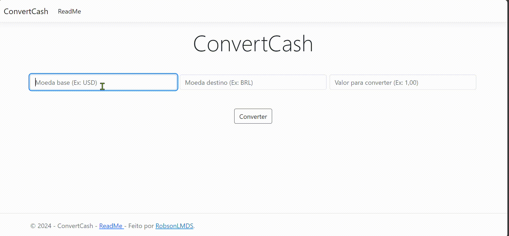

<h1 align="center">
  
</h1>

## Descrição
O ConvertCash é uma aplicação ASP.NET MVC que converte valores de uma moeda base para uma moeda alvo utilizando uma API de taxas de câmbio. Ele busca as taxas de conversão mais recentes de uma API externa e permite ao usuário inserir uma moeda base, uma moeda alvo e um valor a ser convertido.

## Funcionalidades
- Busca automática de taxas de câmbio em tempo real através da API ExchangeRate API.
- Conversão de valores entre diferentes moedas.
- Verificação de erros ao procurar moedas não encontradas.
- Exibição da taxa de conversão e do valor convertido no front-end.

## Estrutura do Projeto
O controlador principal utilizado para gerenciar a conversão de moedas é o `CheckConvertController`. Ele se conecta à API de taxas de câmbio e processa a conversão com base nos valores inseridos pelo usuário.

### Controlador: `CheckConvertController`
- **Index (GET)**: Renderiza a página inicial da aplicação (HomeSite).
- **Index (POST)**: Recebe as entradas do usuário para as moedas base e alvo, bem como o valor a ser convertido. Através de uma solicitação à API de taxas de câmbio, calcula o valor convertido e exibe os resultados para o usuário.

## Fluxo de Funcionamento
1. O usuário acessa a página inicial da aplicação.
2. O usuário insere a moeda base, a moeda alvo e o valor a ser convertido.
3. O `CheckConvertController` faz uma solicitação à API de câmbio para obter as taxas de conversão mais recentes.
4. O valor é convertido e o resultado é exibido na página.

## Tecnologias Utilizadas
- **ASP.NET Core MVC**: Estrutura principal para o desenvolvimento do projeto.
- **C#**: Linguagem de programação utilizada.
- **ExchangeRate API**: API externa usada para buscar as taxas de câmbio.
- **Newtonsoft.Json**: Biblioteca utilizada para desserializar os dados JSON da API.

  
<h1 align="center">

</h1>
